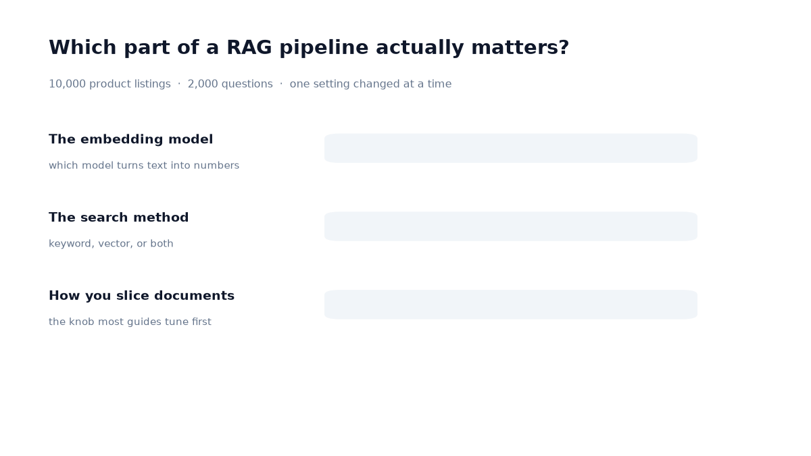
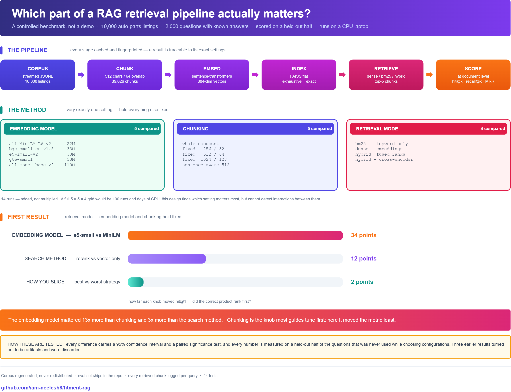

# fitment-rag

Which part of a retrieval pipeline actually determines quality — the embedding model, the chunking
strategy, or the retrieval algorithm?

This measures all three on 10,000 auto-parts product listings, varying one at a time, with
confidence intervals and paired significance tests. Runs on a CPU laptop: no GPU, no API keys,
no paid services.

**Answer: the embedding model, by a wide margin.**



---

## Results

10,000 documents, 2,000 questions, scored on a held-out half (n=959).

| factor | best → worst | spread | significant |
|---|---|---|---|
| Embedding model | 0.856 → 0.518 | **33.8 pp** | yes, p < 0.0001 |
| Retrieval mode | 0.981 → 0.856 | **12.3 pp** | yes, p < 0.0001 |
| Chunking strategy | 0.878 → 0.853 | **2.5 pp** | yes, p = 0.021 |

Embedding model choice moved hit@1 **13× more than chunking** and **3× more than retrieval mode**.

<details>
<summary><b>Full results table</b></summary>

Held-out test split. `hit@1` = fraction of questions whose correct product ranked first.

| config | hit@1 | 95% CI | ms/query |
|---|---|---|---|
| hybrid + cross-encoder rerank | 0.981 | [0.971, 0.988] | 1373 |
| hybrid (RRF) | 0.937 | [0.920, 0.951] | 80 |
| BM25 | 0.925 | [0.906, 0.940] | 81 |
| dense, sentence-512 chunks | 0.878 | [0.856, 0.897] | 3 |
| dense, fixed-256 chunks | 0.866 | [0.842, 0.886] | 3 |
| dense, fixed-1024 chunks | 0.864 | [0.841, 0.885] | 3 |
| dense, fixed-512 chunks (e5-small) | 0.856 | [0.832, 0.877] | 4 |
| dense, whole documents | 0.853 | [0.829, 0.874] | 3 |
| dense, bge-small | 0.759 | [0.731, 0.785] | 5 |
| dense, gte-small | 0.657 | [0.626, 0.686] | 27 |
| dense, all-MiniLM-L6-v2 | 0.518 | [0.487, 0.550] | 2 |

Paired comparisons on the same split:

| comparison | difference | wins | p |
|---|---|---|---|
| e5-small vs MiniLM | +33.8 pp | 348–24 | <0.0001 |
| e5-small vs bge-small | +9.7 pp | 123–30 | <0.0001 |
| BM25 vs dense | +6.9 pp | 112–46 | <0.0001 |
| rerank vs hybrid | +4.4 pp | 54–12 | <0.0001 |
| sentence-512 vs whole documents | +2.5 pp | 62–38 | 0.021 |
| sentence-512 vs fixed-512 | +2.2 pp | 44–23 | 0.014 |
| hybrid (alpha=0.5) vs BM25 | +1.3 pp | 48–36 | 0.230 (tied) |
| hybrid (alpha=0.35) vs BM25 | +2.1 pp | 34–14 | **0.0055** |

</details>

<p align="center">
  <a href="assets/summary-diagram.png">
    
  </a>
  <br><em>The whole study on one page — click to enlarge</em>
</p>

### Three things worth pulling out

**BM25 beats dense retrieval by 6.9 pp.** A keyword-scoring formula from 1994, no neural network,
outperforms a modern embedding model. Auto-parts queries are dominated by brand names and part
codes — rare tokens that BM25 weights heavily and embedding models represent poorly. BM25 is also
the default scorer in Elasticsearch, so this is worth knowing before planning a migration to
vector search.

**Hybrid retrieval helps, but only when weighted toward keywords.** At the common default of
`hybrid_alpha = 0.5` it ties BM25 (0.929 vs 0.925, p = 0.23) — which is what an earlier version of
this README reported. Sweeping the weight shows that default sits in a dip:

| alpha | 0.00 | 0.20 | 0.35 | 0.50 | 0.65 | 0.80 | 1.00 |
|---|---|---|---|---|---|---|---|
| hit@1 | 0.925 | 0.940 | **0.941** | 0.929 | 0.928 | 0.910 | 0.858 |

Around 0.35 — roughly one-third dense, two-thirds keyword — hybrid beats pure BM25 by **2.1 pp
(p = 0.0055)** on held-out questions. The defensible claim is the shape, not the exact peak:
0.20 and 0.35 are indistinguishable from each other, and the peak was chosen by looking at these
same results.

**Chunking barely matters, and only sentence-aware splitting helps.** The best strategy beats the
worst by 2.5 pp. `sentence-512` and `fixed-512` produce almost identical chunk counts (37,277 vs
39,026) but differ by 2.2 pp — so what matters is where the boundary falls, not how many pieces
you make. Median document here is 1,438 characters; on longer documents chunking would matter far
more.

---

## Reproduce it

### 1. Requirements

- Python 3.10 or newer
- [Poetry 2.x](https://python-poetry.org/docs/#installation) — version 1.x will not work, it
  ignores the PEP 621 `[project]` table
- ~4 GB disk for the corpus cache, embeddings, and indexes
- No GPU needed

```bash
git clone https://github.com/iam-neelesh8/fitment-rag.git
cd fitment-rag
poetry install --extras "nb dev"
poetry run fitment-rag doctor
```

`doctor` should print `ok` for torch, sentence_transformers, faiss, and rank_bm25.

> **Windows note.** If `poetry install` fails with a long-path error, the venv is too deep for the
> 260-character limit. The committed `poetry.toml` puts it at `C:\venvs` to avoid this.

### 2. Build the eval set

```bash
poetry run fitment-rag build-evalset --config configs/phase1_smoke.yaml -n 2000
```

Streams 10,000 product listings from Hugging Face and generates 2,000 questions. **~5 minutes.**
Writes `evalsets/amazon_automotive_10k_n2000.jsonl`.

This file is committed, so you can diff yours against it to confirm you generated the same
questions before comparing any numbers.

### 3. Run the experiments

Each group varies one setting. Embeddings are cached, so later runs reuse earlier work.

```bash
# Embedding models — 4 configs, ~30 min each on first run
poetry run fitment-rag sweep --configs "configs/phase1/emb/*.yaml"

# Chunking strategies — 5 configs, ~2 hours total
poetry run fitment-rag sweep --configs "configs/phase1/chunk/*.yaml"

# Retrieval modes — 3 fast configs
poetry run fitment-rag sweep --configs "configs/phase1/retrieval/bm25.yaml"
poetry run fitment-rag run   --config  configs/phase1/retrieval/hybrid.yaml

# The reranker is slow: 1.3 s/query x 2000 = ~45 min
poetry run fitment-rag run --config configs/phase1/retrieval/hybrid-rerank.yaml
```

**Total: 4–5 hours on a 15 W laptop CPU**, dominated by embedding. Runs are independent and
resumable — everything caches to `data/`, so an interrupted sweep picks up where it stopped.

`configs/phase1/emb/mpnet-base.yaml` is provided but was not run; it needs roughly two more hours
and would extend the comparison beyond the 22–33M parameter class.

### 4. Read the results

```bash
poetry run fitment-rag compare --sort hit@1
```

Prints every run with a Wilson confidence interval. Add `--csv results/leaderboard.csv` to export.

### 5. Test whether differences are real

A leaderboard ordering is not a finding. These are the numbers a claim needs:

```python
from fitment_rag.stats import compare_runs_split, scores_by_split

# Paired significance test on the held-out split
compare_runs_split("emb-e5-small", "emb-minilm-l6", split="test")
# {'difference': 0.3379, 'a_wins': 348, 'b_wins': 24, 'p_value': 0.0, 'significant': True}

# Check a config was not simply fitted to the selection half
scores_by_split("emb-e5-small")
# {'dev': {'score': 0.8588}, 'test': {'score': 0.8561}, 'dev_minus_test': 0.0027}
```

For a whole group at once:

```python
from fitment_rag.stats import significance_table
significance_table(["chunk-sent512", "chunk-fixed512", "chunk-whole",
                    "chunk-fixed256", "chunk-fixed1024"])
```

Read the `bonferroni_significant` column, not `significant` — ten comparisons at α=0.05 will
produce a false positive about half the time.

### 6. Notebooks (optional)

```bash
poetry run python -m ipykernel install --user --name fitment-rag \
    --display-name "Python (fitment-rag)"
poetry run jupyter lab notebooks/
```

| notebook | contents |
|---|---|
| `00_understand_the_data.ipynb` | The real schema — field fill rates, the `details` long tail, document lengths, how a row becomes retrievable text |
| `01_pipeline_walkthrough.ipynb` | The pipeline one stage at a time |
| `02_retrieval_experiments.ipynb` | Sweeps and the leaderboard |

---

## How it works

```
Amazon Automotive        stream JSONL, cache locally      data/raw/
product metadata    ->   10,000 documents
(5.35 GB on HF)               |
                              v
                         split into chunks                 data/chunks/
                         ids are {doc_id}::{ordinal}
                              |
                              v
                         embed with sentence-transformers  data/embeddings/
                         L2-normalised, so IP == cosine
                              |
                              v
                         FAISS flat index (exact)          data/indexes/
                              |
   question  ----------->  retrieve: dense / bm25 / hybrid
                           dedupe to top-5 documents
                              |
                              v
                         score: hit@k, MRR, nDCG           results/{run_id}/
```

`run_id` is a hash of the config, so a results directory names the exact settings that produced
it. Two runs that differ in any setting cannot collide.

### What makes the numbers trustworthy

**One variable at a time.** All 14 configs are generated from a single base in
`scripts/gen_configs.py`, so the only difference between two runs is the setting named in the
filename.

**Scored per document, not per chunk.** Chunk counts vary 7× across strategies. `top_k` counts
distinct documents, so a strategy producing more chunks does not get more candidate documents for
free — an earlier version counted chunks and that alone reversed the chunking ranking.

**Held-out split.** `e5-small` was selected because it won, so reporting its score on the same
questions would inflate it. Every configuration decision is made on `dev`; every headline number
comes from `test`. Mean dev−test gap across all runs: 0.6 pp.

**Confidence intervals and paired tests on everything.** At n=200 the interval on hit@1 is ±5 pp,
wide enough to make a 2 pp difference look like a trend. At n=2,000 it is ±1.6 pp.

**Every query is auditable.** `results/*/records.jsonl` holds the retrieved chunks and per-query
scores for every question, so any average can be checked against the cases behind it.

**Corpus checksums.** Every `metrics.json` carries a hash of the documents used. Compare it before
comparing scores.

---

## Data

Amazon Reviews 2023, Automotive product metadata (McAuley Lab, UCSD) — research use with
citation, not licensed for re-hosting. The corpus is therefore **regenerated, never
redistributed**: `data/` is gitignored and rebuilt by the commands above.

The eval set *is* committed, since it is the artifact a reader needs to check the numbers.

Questions are generated deterministically, with answers extracted from metadata fields rather than
written by a model. Three rules keep them honest, each with a regression test in
`tests/test_evalset.py`:

1. **No verbatim titles.** An earlier version quoted the full product title, so every question
   contained its target document's first line. Every config scored a perfect 1.000 and the
   benchmark could not distinguish anything.
2. **No answer leakage.** Terms appearing in the answer are stripped, so "Who makes the Bosch
   brake pad?" cannot give away "Bosch".
3. **Unique by construction.** Terms are added until exactly one document matches, so the correct
   answer is never ambiguous.

Full provenance in [`DATA_LICENSES.md`](DATA_LICENSES.md). No scraped or proprietary catalogs are
used anywhere in this project.

---

## Limitations

- **One domain.** Auto-parts product listings only. Nothing here says how these results transfer
  to long documents, technical manuals, or support tickets.
- **Chunking and retrieval results come from a single sample.** The embedding result was
  replicated on a second, independent 10,000-document sample (gap of 33.3 and 32.1 pp, sharing
  ~5% of documents); the other two were not.
- **Questions are templated.** Terms are drawn from product titles and validated by lexical
  overlap, which favours BM25. The task is closer to entity lookup than to open-ended question
  answering.
- **The task may be near ceiling.** Reranking reaches 0.981 and `hit@5` exceeds 0.95 nearly
  everywhere, so `hit@5` no longer separates configurations.
- **Timings are unreliable.** Measured on a thermally throttled laptop while other work was
  running. `gte-small` at 27 ms/query against 4 ms for identically sized models is almost
  certainly contention, not a model property.
- **Exact search only.** No approximate-index comparison, and the corpus is small enough that
  approximate search would solve a problem that does not exist here.
- **No generation step.** This measures retrieval only. An LLM cannot recover a document that was
  never retrieved, so retrieval is settled first.

---

## Layout

```
src/fitment_rag/
  config.py           run configuration; hashes into run_id / corpus_id / index_id
  data/amazon.py      corpus streaming, row -> document flattening, checksums
  chunking.py         whole document / fixed size / sentence aware
  embedding.py        sentence-transformers wrapper with a vector cache
  vectorstore.py      exact FAISS index
  retrieval.py        dense, BM25, hybrid RRF, optional cross-encoder rerank
  evalset/build.py    deterministic question generator
  metrics/retrieval   hit@k, recall@k, precision@k, MRR, nDCG
  stats.py            Wilson intervals, paired McNemar, dev/test split
  pipeline.py         one full run, with per-stage caching
  report.py           the leaderboard
  cli.py              doctor / build-evalset / run / sweep / compare

configs/              14 experiment configs, generated from one base
evalsets/             committed: the questions and their answers
notebooks/            data exploration and walkthroughs
context/              project background, plan, architecture, decision log
tests/                44 tests, no network or model downloads required
```

```bash
poetry run pytest -q        # 44 tests, under a second
```

## License

MIT
